# TNbadge hardware

## Printed Circuit Board

- designed in Kicad

- imported into [EasyEDA Pro](https://pro.easyeda.com)

   - manually reattached lanyard/stencil-alignment holes, battery box slots, an zero-size holes to net GND
 with direct connect (i.e. no thermal relief)

   - manually reattached quarter-circle track around pin 2 of epaper display connector, top left,
to net /GPIO1{SLASH}DC

   - manually re-edited APA102 footprint to remove solder mask/stencil openings over (center) duplicate GND/5V pads

   - manually edited all testpoints to show correct designator, on back silkscreen layer

   - manually imported QR code PNG (M1) onto back silkscreen layer (Kicad plays poorly)

   - manually adjusted color of silkscreen artifacts

- multicolour PNG artwork imported to front silkscreen layer

- ordered from [JLC PCB](https://jlcpcb.com)

## component sources

- already in hand (through-hole LDRs)

- [LCSC](https://lcsc.com) (SMD resistors & capacitors)

- [Seeed Studio](https://seeedstudio.com) (CPU module)

- [AliExpress](https://aliexpress.com) (everything else)

# assembly and test

## front surface mount

### assemble

- position PCB back-down on stable heat-resistant surface

- stencil solder paste on front

- [place](i/00-100k-b.jpg) [2x 100k resistor](i/00-100k-a.jpg) (2010)  
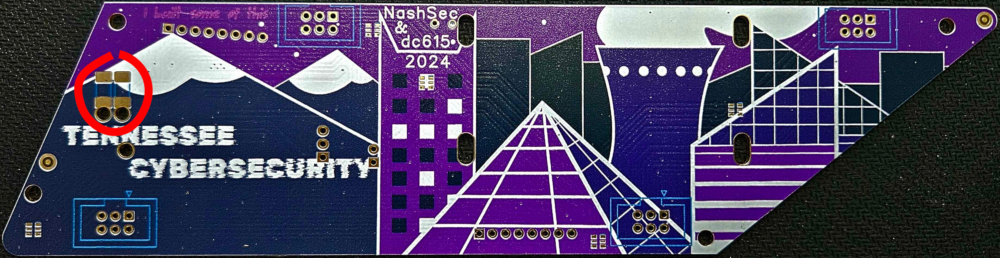

- [place](i/03-APA102-b.jpg) 5x [APA102 addressable RGB LED](i/03-APA102-a.jpg) (2020)  
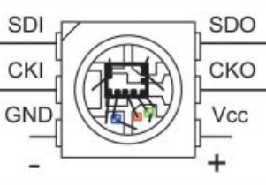
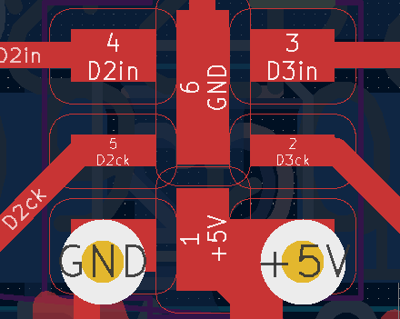
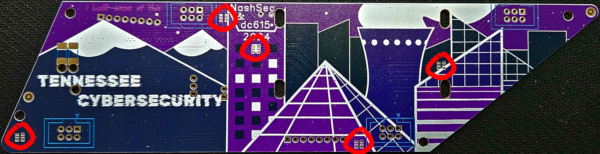

- (optional) preheat to 100 degC

- apply hot air at 200+ degC to each component until solder flows to create concave surface

### test

- position board front-down on stable non-conductive surface

- starting at lower right corner, test continuity between each pair of pads from the set
{test points, CPU pads}

- continuity is expected between

   - TP1 CPU13 CPU\_GND CPU\_BAT-

   - TP2 CPU\_BAT+

   - TP3 CPU12

   - TP15 CPU8

   - TP18 CPU7

   - TP20 CPU1

- continuity between any pair of test points,
or between any pair of CPU pads,
or between any other test points and CPU pads
indicates a likely solder bridge

- continuity between any of TP5 through TP14 and TP4 or TP1
indicates a bridge between pads of one of the smart LEDs either side of the
involved TP5...TP14

Data point: after soldering only the front components (5x smart LED, 2x resistor) on 5 boards,
I had *1* board with no erroneous beeps in the continuity test.

### rectify

For each identified fault

- desolder identified likely culprit components

- flux and wick up solder from PCB

- re-test to verify fault is gone; if fault remains, dig deeper

- flux pads and reposition component

- reflow remaining solder

- add minimal solder if needed

- re-test to verify fault is gone

Mr Clumsyhands has found a trap for young players:
once you've played some hot air over a SMD LED,
its little transparent top becomes soft enough for your tweezers to wipe it off,
along with the actual silicon bits underneath, if you twitch while applying pressure to the side of the package.

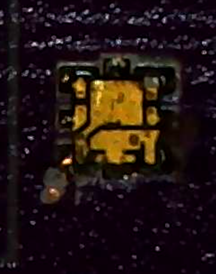

So, don't do that.

## back surface mount

### assembly

- position PCB front-down on stable heat-resistant surface

- stencil solder paste on back

- [place](i/04-TXS0104-b.jpg) [1x level shifter chip](i/04-TXS0104-a.jpg) (TSSOP)
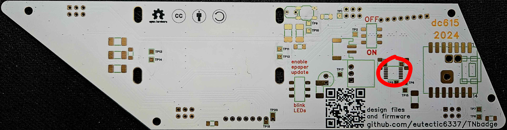

- [place](i/05-pbsw-b.jpg) [1x pushbutton switch](i/05-pbsw-a.jpg)
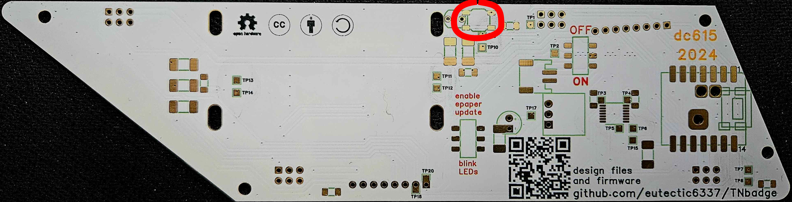

- place 1x 100 ohm resistor (2010)
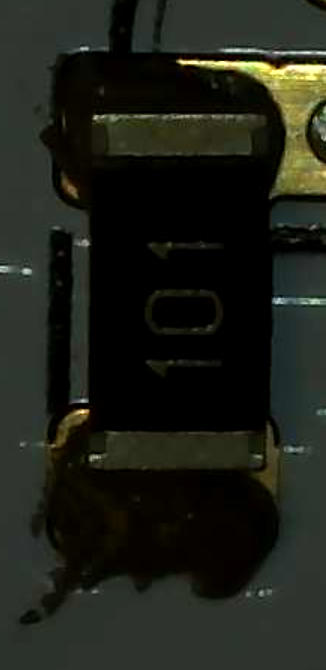

- [place](i/07-10k-b.jpg) 6x [10k resistor](i/07-10k-a.jpg) (2010)
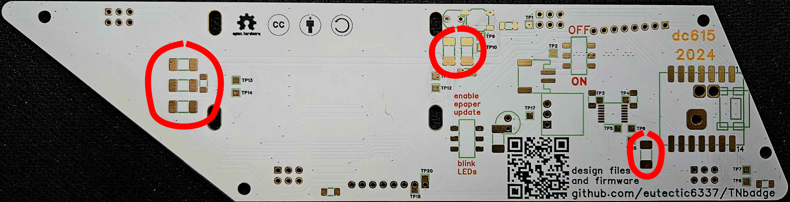

- [place](i/08-1uF-b.jpg) 7x [1uF capacitor](i/08-1uF-a.jpg) (1206)
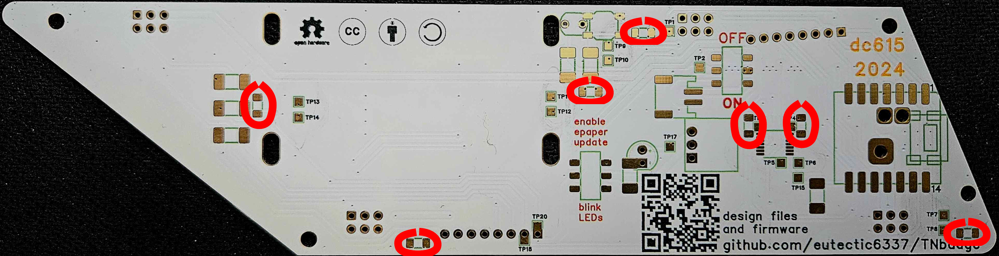

- [place](i/09-pow_sw-b.jpg) 2x [slide switch](i/09-pow_sw-a.jpg)
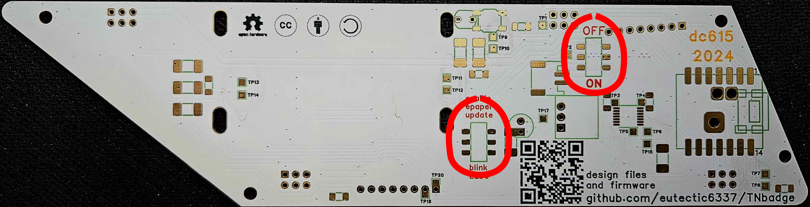

- [place](i/11-batcon-a.jpg) [1x battery connector](i/11-batcon-a.jpg)
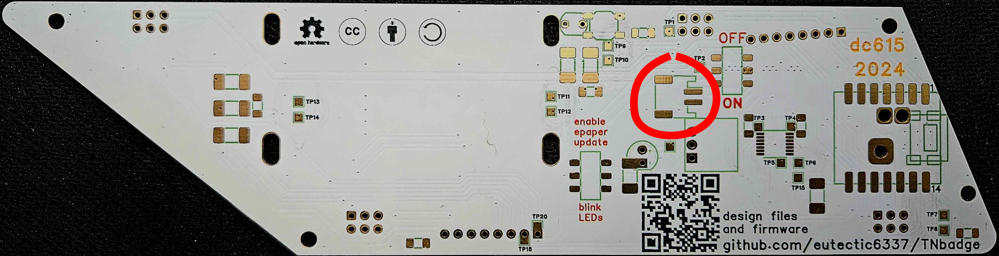

- (optional) preheat to 100 degC

- apply hot air at 200+ degC to each component until solder flows to create concave surface

### test

- position board front-down on stable non-conductive surface

- starting at lower right corner, test continuity between each pair of pads from the set
{test points, CPU pads}

- continuity is expected between

   - TP1 CPU13 CPU\_GND CPU\_BAT-

   - TP2 CPU\_BAT+

   - TP3 CPU12

   - TP15 CPU8

   - TP18 CPU7

   - TP20 CPU1

- continuity between any pair of test points,
or between any pair of CPU pads,
or between any other test points and CPU pads
indicates a likely solder bridge

### rectify

most likely location for bridge is TSSOP level shifter chip

- flux and wick up excess solder from pins on one side

- drag-solder with small wedge/chisel tip iron to reflow remaining solder

- re-test to verify fault is gone; if fault remains, dig deeper

For each other identified fault

- desolder identified likely culprit components

- flux and wick up solder from PCB

- re-test to verify fault is gone; if fault remains, dig deeper

- flux pads and reposition component

- reflow remaining solder

- add minimal solder if needed

- re-test to verify fault is gone

## CPU module

### assembly

- position PCB front-down on stable heat-resistant surface

- apply small dot of solder paste on each of 14 main CPU pads on PCB

- place ESP32C3 CPU module
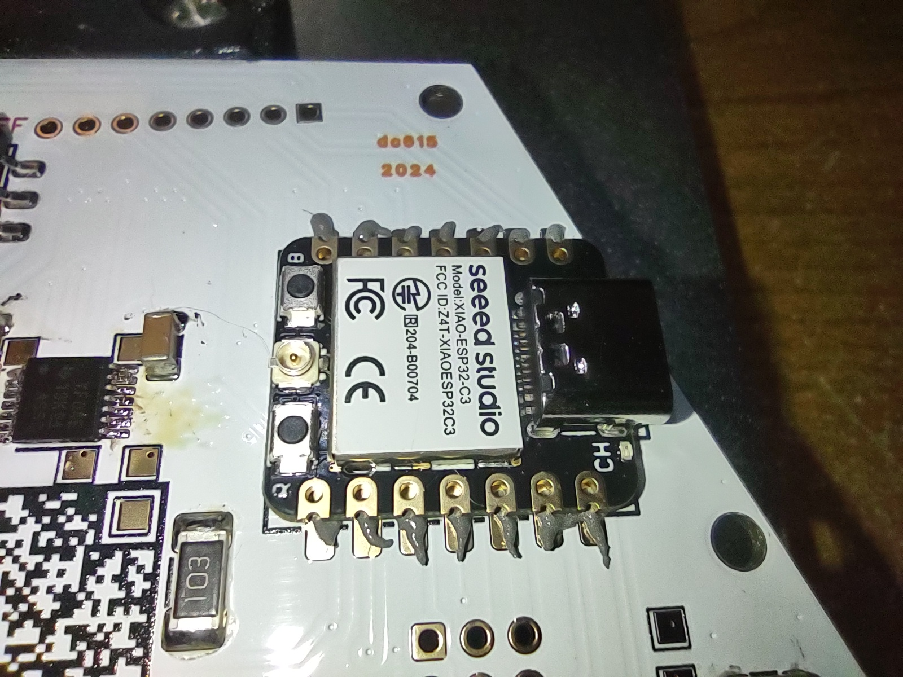

- apply hot air at 200+ degC to each long edge of CPU carrier board
until solder flows to create concave surface
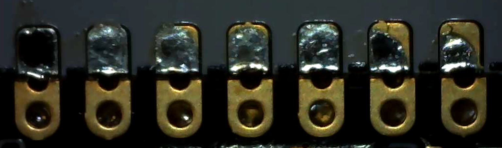
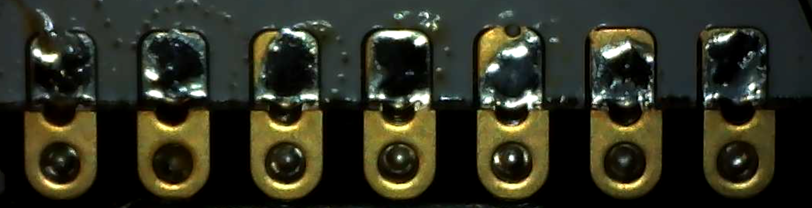

- position PCB back-down on stable heat-resistant surface

- apply small dot of solder paste in each of 3 through-holes under CPU module
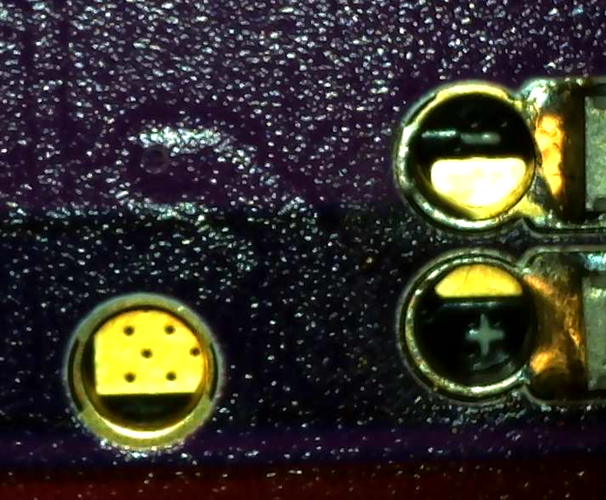
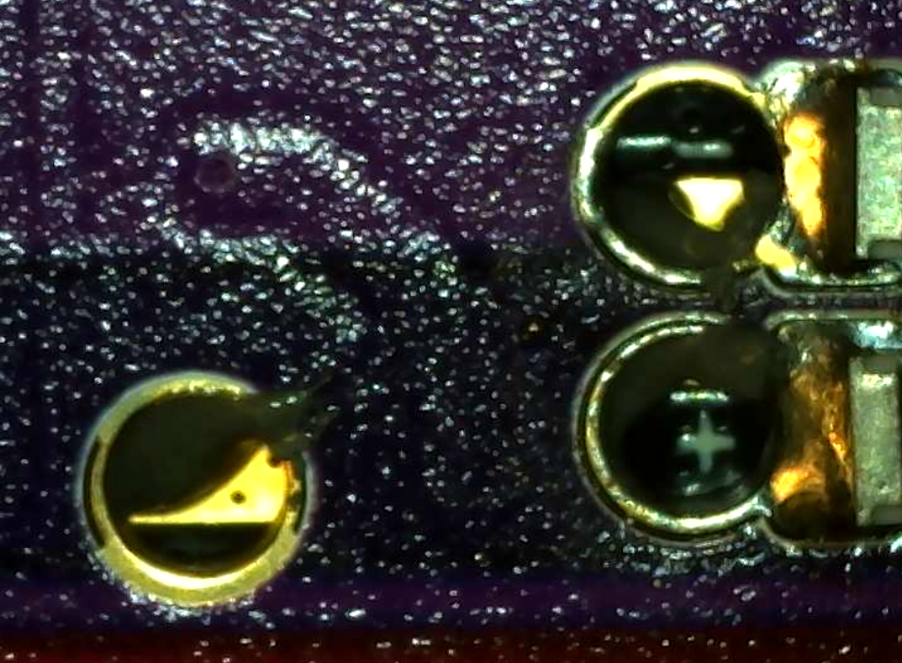

- apply hot air at 200+ degC to holes under CPU carrier board
until solder flows to create concave surface
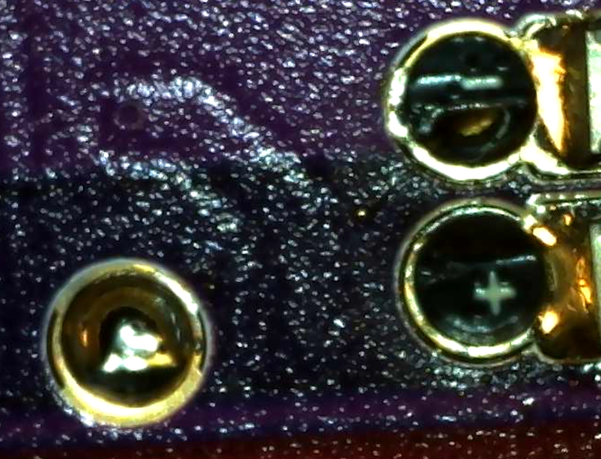

